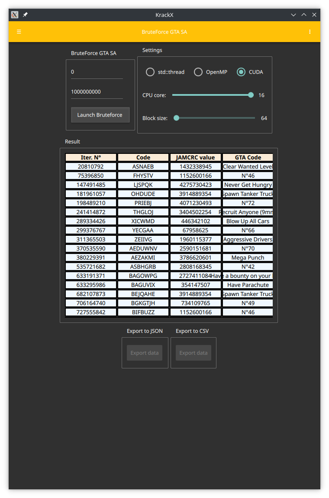

# krackx

The goal of this project is to make a software to crack passwords.
Currently it only supports searching for alternative cheat codes in [GTA SA](https://github.com/bensuperpc/GTA_SA_cheat_finder).

The current steps:

- CUDA Support
- GTA SA bruteforce
- QT QML

The next steps:

- ZIP, 7z support ect...
- Dictionary attack
- Maybe OpenCL
- Android support again

## Images

## Building and installing

See the [BUILDING](BUILDING.md) document.

## Contributing

See the [CONTRIBUTING](CONTRIBUTING.md) document.

## Licensing

[MIT License](LICENSE)
